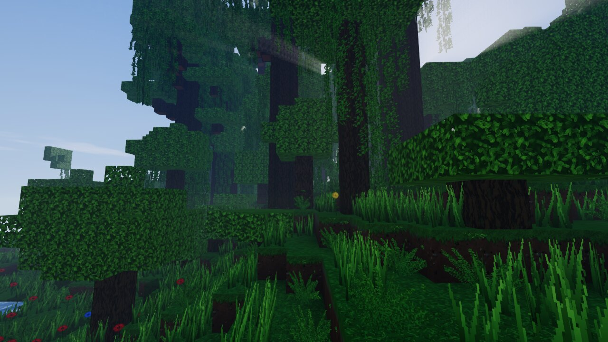
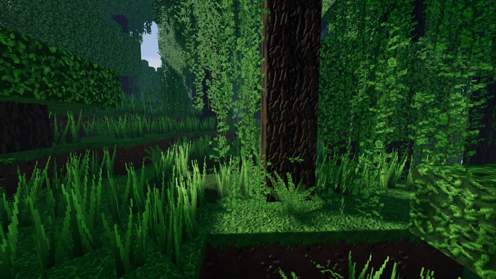
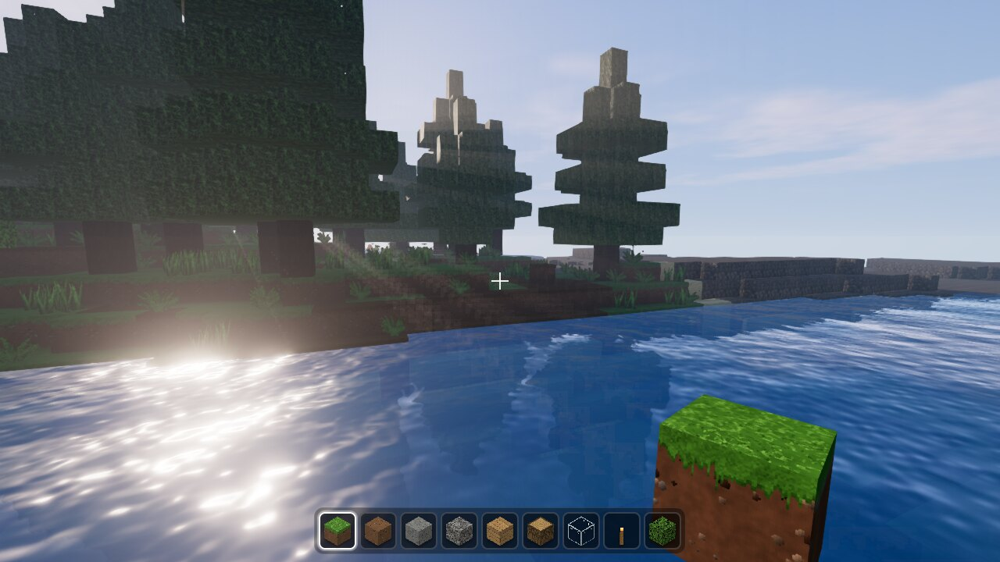
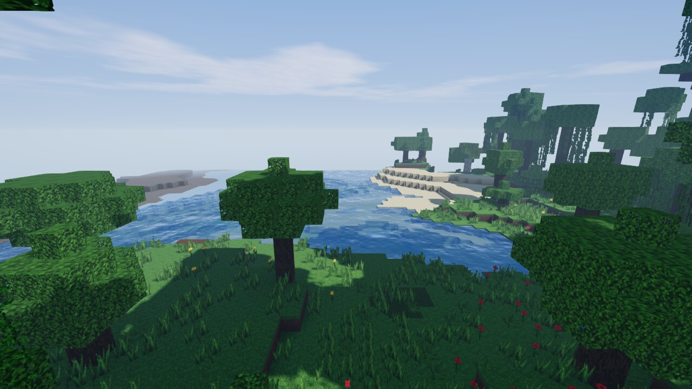
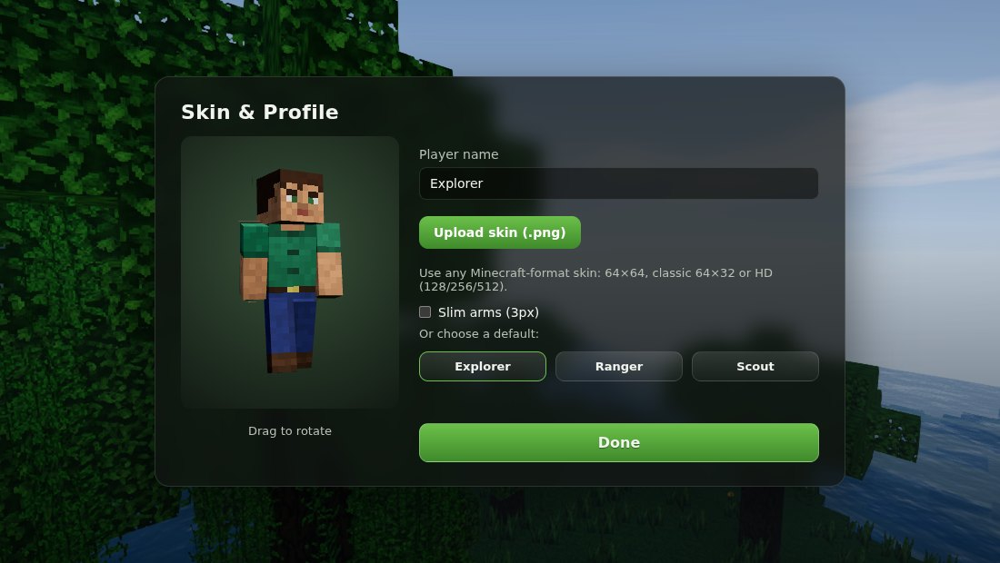

# RealisCraft – realistic Minecraft-style game in your browser

A block-building sandbox with **realistic graphics**: real-time sun shadows, god rays through
the trees, animated water that mirrors the world around it, waving grass and leaves, a day/night cycle with sunsets,
stars and moonlight, warm torch lighting in caves, and high-resolution (64×64) textures with
normal maps.

It has **singleplayer** (worlds are saved in your browser), **multiplayer** (play together with
friends), and **custom skins** (upload any Minecraft-format skin `.png`).



| | |
|---|---|
|  |  |
|  |  |

## How to play (quick start)

1. Install [Node.js](https://nodejs.org) (version 18 or newer).
2. Download this project, open a terminal in its folder and run:

   ```bash
   npm install
   npm start
   ```

3. Open **http://localhost:3000** in Chrome, Edge or Firefox.
4. Click **Singleplayer → Create New World → Create World**, then click the screen to play.

## Controls

| Key | Action |
|---|---|
| **W A S D** or **↑ ← ↓ →** | Move |
| Mouse | Look around |
| **Space** | Jump / swim up — double-tap to fly (creative) |
| **Shift** | Sneak (you won't fall off edges) / fly down |
| **R** or double-tap **W** | Sprint |
| Left click | Break block (hold it in survival) |
| Right click | Place block |
| Middle click | Pick the block you are looking at |
| **1–9** / mouse wheel | Choose hotbar slot |
| **E** | Inventory: block picker (creative) or inventory + crafting (survival) |
| **T**, **Enter** or **/** | Chat and commands (`/help`) |
| **F5** or **V** | First / third person view |
| **F1** / **F2** / **F3** | Hide HUD / screenshot / debug info |
| **Esc** | Pause menu (settings, save & quit) |

Chat commands: `/time set day|noon|sunset|night|midnight`, `/gamemode creative|survival`,
`/tp x y z`, `/spawn`, `/seed`, `/fly`, and `/list` on servers.

## Game modes

- **Creative** – every block is available, instant breaking, flying.
- **Survival** – health and fall damage, drowning, blocks take time to mine and drop into
  your inventory, simple crafting (logs → planks, torches, glass, bricks, …).

## Multiplayer

`npm start` also starts the multiplayer server.

- **Same Wi-Fi / LAN:** the terminal prints an address like `http://192.168.1.20:3000`.
  Friends open that address and click **Multiplayer → Join Server**.
- **Over the internet:** forward port 3000 on your router, or run the server on any Node.js
  host (Render, Railway, Fly.io, a VPS…). Players enter the address in **Multiplayer**.
  If the game page is opened over `https://`, the server must also use `https`/`wss`.

Everyone shares the same world: block changes, chat, the time of day and player skins are
synced. The server saves the world to `server/data/world.json` every 30 seconds and when it
stops.

Server options (environment variables):

| Variable | Meaning | Default |
|---|---|---|
| `PORT` | Port to listen on | `3000` |
| `SEED` | Seed for a new world | random |
| `GAMEMODE` | `creative` or `survival` for new worlds | `creative` |
| `MAX_PLAYERS` | Player limit | `20` |
| `RESET=1` | Start a fresh world (the old one is backed up) | |

Example: `PORT=8080 SEED=jungle npm start` (on Windows PowerShell: `$env:PORT=8080; npm start`).

## Skins

Open **Skin & Profile** on the title screen to set your name and upload a skin. Any
Minecraft-format skin works: 64×64, the classic 64×32 layout, or HD skins (128, 256, 512).
Slim (3-pixel arm) skins are detected automatically. Other players see your skin in multiplayer.

## Graphics settings

If the game runs slowly, open **Settings** and choose a lower **Graphics quality** or reduce
the **Render distance**:

- **Low** – no shadows or post-processing (fastest; good for laptops)
- **Medium** – sun shadows + bloom
- **High** – shadows, god rays, water reflections, bloom (default)
- **Ultra** – 4K shadow maps, sharper reflections, full resolution

The game needs a browser with WebGL 2 (all current versions of Chrome, Edge, Firefox and Safari).

## Play without installing (GitHub Pages)

Singleplayer also works as a static website:

1. On GitHub open **Settings → Pages** and set **Source** to **GitHub Actions**.
2. Open **Actions → Deploy to GitHub Pages → Run workflow**.

To build the static files yourself, run `npm run build:static` and upload the `dist` folder to
any static web host.

## For developers

```
public/            browser game (no build step, plain ES modules + three.js)
  js/engine/       world generation, meshing, lighting, rendering, physics, networking
  js/ui/           HUD, inventory, block icons
server/server.js   static file server + WebSocket multiplayer server
tests/             unit and integration tests (node --test)
```

- `npm test` runs the tests (terrain, lighting, meshing, player physics, multiplayer server).
- Terrain generation, lighting and meshing run in Web Workers. Every chunk is a pure function of
  the world seed, so only player edits are saved and sent over the network.
- All textures and sounds are generated in code, so there are no asset files to download.

RealisCraft is a fan-made project and is not affiliated with Mojang or Microsoft.
